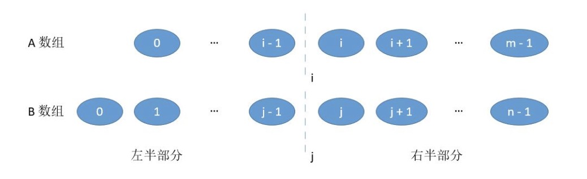

### 4. 寻找两个有序数组的中位数（困难）
#### 题目描述
给定两个大小为m和n的有序数组nums1和nums2。
请你找出这两个有序数组的中位数，并且要求算法的时间复杂度为O(log(m + n))。
你可以假设nums1和nums2不会同时为空。
##### 示例1:
```bash
nums1 = [1, 3]
nums2 = [2]

则中位数是 2.0
```
##### 示例2:
```bash
nums1 = [1, 2]
nums2 = [3, 4]

则中位数是 (2 + 3)/2 = 2.5
```

#### 代码
##### 解法1: 定义第三个数组重排序
一开始看到这道题很自然的想到再多定义一个列表数组将两个数组重排序，但是像python里的sort方法就不用了，这样就没意思了。具体代码如下。
```python
#时间复杂度O(m+n)
class Solution:
    def findMedianSortedArrays(self, nums1, nums2):
        nums3 = []
        mid = (len(nums1)+len(nums2))//2
        flag = (len(nums1)+len(nums2))%2
        i, j= 0, 0
        while(i<len(nums1) and j<len(nums2)):
            if nums1[i]>nums2[j]:
                nums3.append(nums2[j])
                j+=1
            else:
                nums3.append(nums1[i])
                i+=1
        while(i<len(nums1)):
            nums3.append(nums1[i])
            i+=1
        while(j<len(nums2)):
            nums3.append(nums2[j])
            j+=1
        if(flag == 1):
            return nums3[mid]
        else:
            return (nums3[mid-1]+nums3[mid])/2
```
但是题目的要求时间复杂度为$O(log(m+n))$，虽然提交成功了，但我们需要降低时间复杂度啊...一看到log，那肯定是要用到二分法啊，看了评论区大佬的解答，还有下面两种解法。

##### 解法2：取第k小的数
所谓取中位数，那么不就是取第k小的数吗，如果是奇数，那就是取最中间那个数，也就是`k = (m+n+1)/2`，如果是偶数，那就是取`k1 = (m+n+1)/2`和`k2 =（m+n+2)/2`位置数的平均值。
这里可以用到一个小trick，因为当数组维数是奇数的时候，(m+n+1)是偶数，我们进行的又是模2运算，因此变成`k = (m+n+2)/2`和原来是相等的，这样也变成和偶数时一样的k1和k2，就可以不用分情况讨论了。
所以接下来我们所要求的就是第k1小的和第k2小的数，然后二者相加除以二就是我们最终的答案了。
那接下来问题就转化为如何在两个数组中求第k小的数，题目要求中时间复杂度要为$O(log(m+n))$，因此我们要用到二分法，也就是说，我们可以在两个数组中分别取前`k/2`个数（因为是有序数组嘛，前`k/2`也就是`k/2`个较小的，降序反之亦然），比较取出的这两组数据的最后一位哪个更小，我们便去掉该`k/2`个，如果相等就随便去掉那一组都可以。但是还有一个问题：当某一组数不够`k/2`的时候，那就将其最后一个数与另一组第`k/2`个比较，如果这组数都被淘汰了，那就剩一组数据了，在一组数据中取第k小的数就可以直接return了。因此在取`k/2`之前我们还要判断数组的数量够不够。之后进行递归，因为去掉了`k/2`个数，因此下一轮的`k = k - k/2`，直到当`k = 1`时，递归结束，这时候每组数据都取了一个，`k = 1`的意思不就是取最小的数嘛，所以只要比较这两个数哪一个更小，哪一个就是答案。
```python
#O(log(m+n))
class Solution:
    def findMedianSortedArrays(self, nums1, nums2):
        m = len(nums1)
        n = len(nums2)
        left = (m+n+1)//2
        right = (m+n+2)//2
        return (self.findKth(nums1, nums2, left) + self.findKth(nums1, nums2, right))/2
    # 取第k小的数
    def findKth(self, nums1, nums2, k):
    	# 注意判断列表为空时不能用 nums1 == None
    	# 因为取第k小的数一定有答案，因此不存在两个数组都为空的情况
        if len(nums1) == 0:
            return nums2[k-1]
        if len(nums2) == 0:
            return nums1[k-1]
        # 正常的递归结束出口
        if k==1:
            return min(nums1[k-1], nums2[k-1])
        # k!=1，进行递归，可以利用列表的切片功能轻松返回剩余数组
        else:
            n = k//2
            if n > len(nums1):
                if nums1[-1] < nums2[n-1]:
                    return self.findKth([], nums2, k-len(nums1))
                else:
                    return self.findKth(nums1, nums2[n:], k-n)
            if n > len(nums2):
                if nums2[-1] < nums1[n-1]:
                    return self.findKth(nums1, [], k-len(nums2))
                else:
                    return self.findKth(nums1[n:], nums2, k-n)
            if nums1[n-1] < nums2[n-1]:
                return self.findKth(nums1[n:], nums2, k-n)
            else:
                return self.findKth(nums1, nums2[n:], k-n)
```
##### 解法3: 从中位数的定义出发
解析主要参考`LeetCode`用户`windliang`的题解。

因为中位数的定义是一个可以将数值集合划分为相等的上下两部分的一个数值，因此我们可以考虑对题中给的两个数组进行划分，划分成左右两个部分，如下图所示：

当我们用i和j把A、B数组划分为这样的两个部分，如果满足下列条件：
* `A_left + B_left == A_right + B_right` (如果`len(A)+len(B)`为奇数，就让左半部分比又半部分多一个，这样中位数就是左半部分最后一个值)
* `max(A_left[i-1], B_left[j-1]) < min(A_right[i], B_right[j])`

那么我们就可以得到中位数的答案：
* 如果`len(A)+len(B)`为奇数，`ans = max(A_left[i-1], B_left[j-1])`
* 如果`len(A)+len(B)`为偶数，`ans = (max(A_left[i-1], B_left[j-1]) + min(A_right[i], B_right[j])) / 2`

对第一个条件，要使他们划分成这样的两个部分，那么i和j具体值应该取多少呢？
为了降低时间复杂度，i的取值可以用二分法，而j又与i有直接关系，假设`len(A) = m`,`len(B) = n`,`(m+n)%2 == 0`
因为`i + j = m - i + n - j`
故`j = (m + n)/2 - i`
当`(m+n)%2 == 1`时，有`i + j = m - i + n - j + 1`，故`j = (m + n + 1)/2 - i`

由于当`(m+n)%2 == 0`时，模2和加1之后再模2的值相等，因此j的取值公式可以通用为
`j = (m + n + 1)/2 - i`
当我们把`i`当作自变量时，`0 <= i <= m`，为了保证`0 <= j <= m`，因此我们要使`m <= n`

对于第二个条件，因为题目给的数组是有序的，自然会满足`A_left[i-1] < A_right[i]`和`B_left[j-1] < B_right[j]`
因此我们只要使`A_left[i-1] < B_right[j]`和`B_left[j-1] < A_right[i]`就可以满足了第二个条件。
当不满足该条件时可以发现有两种情况：
* `i < m and j > 0 and B_left[j-1] > A_right[i]`
这时需要增加i，（从上面j的公式可以看出当`i<m`时，j一定大于0，因此条件可以简化为`i < m and B_left[j-1] > A_right[i]`）
* `i > 0 and j < n and A_left[i-1] > B_right[j]`
这时需要减小i，（从上面j的公式可以看出当`i>0`时，j一定小于n，因此条件可以简化为`i > 0 and A_left[i-1] > B_right[j]`）

另外还有两种边界情况（具体可分为4种），即`i = 0`和`i = m`，具体可分为`i = 0, j != n` `i = 0, j = n` `i = m, j = 0` `i = m, j != 0`

```python
class Solution:
    def findMedianSortedArrays(self, nums1, nums2):
        m = len(nums1)
        n = len(nums2)
        if m > n: #m需要小于等于n
            nums1, nums2, m, n = nums2, nums1, n, m
        if m == 0:
            return (nums2[(n+1)//2-1]+nums2[(n+2)//2-1])/2.0

        imin, imax, half_len = 0, m, (m+n+1) // 2
        #二分法确定i的值
        while imin <= imax:
            i = (imin + imax) // 2
            j = half_len - i
            if i < m and nums2[j-1] > nums1[i]:
                imin = i + 1
            elif i > 0 and nums1[i-1] > nums2[j]:
                imax = i - 1
            #达到要求，将边界情况列出分别讨论
            else:
                if i==0 :
                    max_of_left = nums2[j-1]
                    if(j!=n):
                        max_of_right = min(nums1[i], nums2[j])
                    else:
                        max_of_right = nums1[i]
                    break
                elif i==m:
                    if(j!=0):
                        max_of_left = max(nums1[i-1], nums2[j-1])
                    else:
                        max_of_left = nums1[i-1]
                    max_of_right = nums2[j]
                    break
                #一般情况
                else:
                    max_of_left = max(nums1[i-1], nums2[j-1])
                    max_of_right = min(nums1[i], nums2[j])
                    break
        if (m+n)%2 == 1:
            return max_of_left
        else:
            return (max_of_right+max_of_left)/2.0
```
